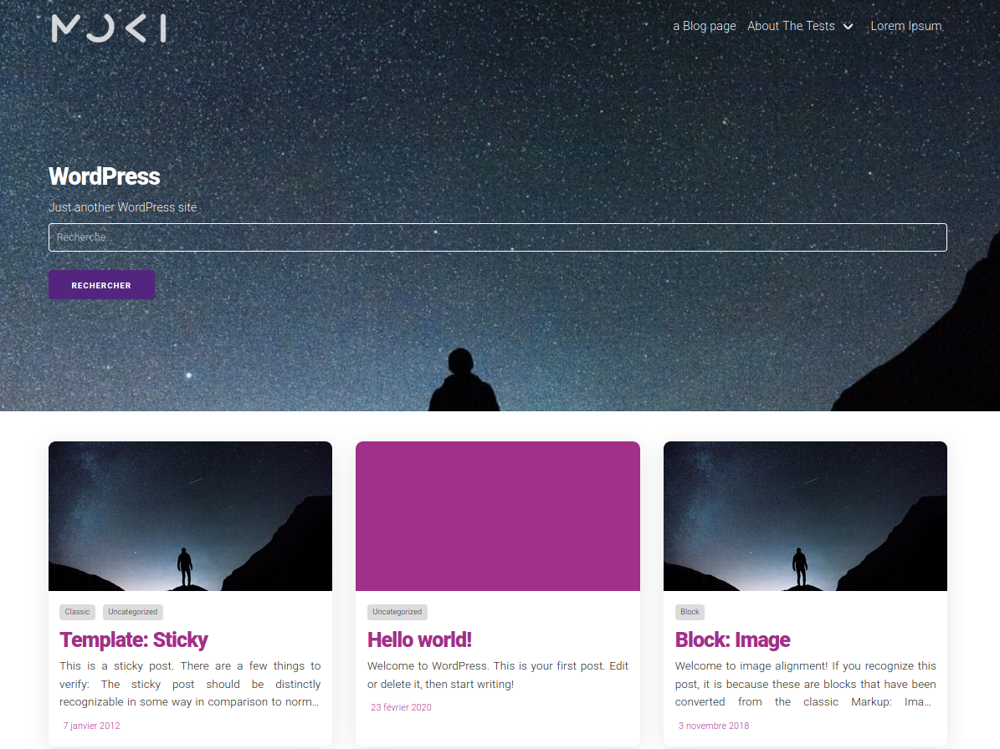

MokiMe is a simple theme with *minimalist* and *material design* supercharged for performance and SEO.

<table>
   <tr>
     <th><a href="https://validator.w3.org/nu/?doc=https%3A%2F%2Fwww.security-helpzone.com%2F">W3C Validator</a></th>
     <th><a href="https://developers.google.com/speed/pagespeed/insights/?hl=fr&url=https%3A%2F%2Fwww.security-helpzone.com%2F">Google Pagespeed</a></th>
     <th><a href="https://tools.pingdom.com/#5c3b68a1d5800000">Pingdom Speed Test</a></th>
     <th><a href="https://gtmetrix.com/reports/www.security-helpzone.com/VtbhJkUk">GTMetrix</a></th>
     <th><a href="https://www.webpagetest.org/result/200318_QA_fb195bb56ac7000d21d8b48537d1198d/">WebPageTest</a></th>
     <th><a href="https://themecheck.info/">Theme Check</a></th>
     <th><a href="https://search.google.com/structured-data/testing-tool?hl=fr#url=https%3A%2F%2Fwww.security-helpzone.com">Google Rich Snippet</a></th>
   </tr>
   <tr align="center">
     <td>0 error</td>
     <td>100 / 100</td>
     <td>93/100</td>
     <td>100/100 - 93/100</td>
     <td>A</td>
     <td>97%</td>
     <td>Pass</td>
   </tr>
 </table>

**DEMO : https://www.security-helpzone.com**

## Docs

* [Installation guide](docs/install.md)
* [Production build](docs/production.md)
* [Todo list](docs/todo.md)

## MokiMe is build on top of

* [WordPress best practices](https://make.wordpress.org/themes/handbook/review/resources/)
* [WordPress Coding Standard (wpcs)](https://github.com/WordPress/WordPress-Coding-Standards)
* [CSS coding style](https://github.com/necolas/idiomatic-css/tree/master/translations/fr-FR)

## Credits

* [@Acoli](https://acoli.fr/) for the design
* [WordPress](https://wordpress.org)
* [Gutenberg](https://fr.wordpress.org/gutenberg/)
* [TwentyTwenty](https://fr.wordpress.org/themes/twentytwenty/)
* [Ionicons](https://ionicons.com/)
* [Auke1810](https://gist.github.com/Auke1810/f2a4cf04f2c07c74a393a4b442f22267)
* [Bulma](https://bulma.io)
* [Milligram](https://milligram.io)
* [FakerPress](https://fr.wordpress.org/plugins/fakerpress/)
* [Coolors](https://coolors.co)
* [For screenshot.png generation](https://croppola.com/)
* Demo pictures
    * https://www.pexels.com/photo/back-view-backlit-calm-waters-cold-590141/
    * https://www.pexels.com/photo/silhouette-of-man-and-trees-753994/
    * https://www.pexels.com/photo/man-standing-on-green-hill-3363363/
    * https://www.pexels.com/photo/person-overlooking-white-clouds-1687920/
    * https://www.pexels.com/photo/silhouette-of-man-standing-on-grass-field-during-night-time-3706707/
    * https://www.pexels.com/photo/mountain-photo-during-nighttime-2086917/
    * https://www.pexels.com/photo/silhouette-of-man-standing-near-body-of-water-1136571/
* [tota11y](https://khan.github.io/tota11y/)
## Recommended plugins

* Contact Form 7
* Yoast SEO
* WP Super Cache
* Autoptimize
